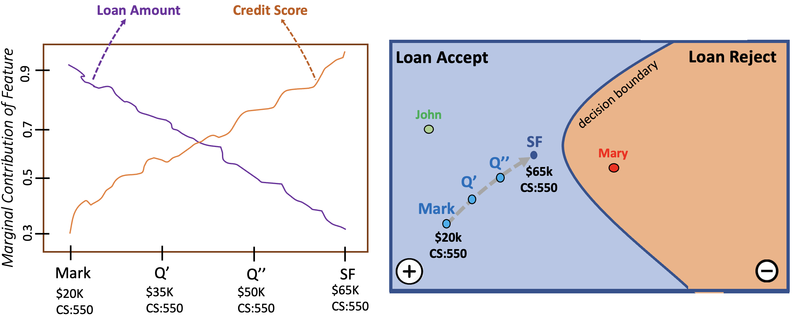

# Informative Semi-factuals for XAI




This is the repository for the paper *"Informative Semi-Factuals for XAI: The Elaborated Explanations that People Prefer*.


Semi-factual or *Even if* explanations explains how a predicted outcome *can remain the same* even when certain input-features are altered. For example, in the commonly-used banking app scenario, a semi-factual explanation could inform customers about better options, other alternatives for their successful application, by saying "Even if you asked for double the loan amount, you would still be accepted". Most semi-factuals XAI algorithms focus on finding maximal value-changes to a single key-feature that do not alter the outcome (unlike counterfactual explanations that often find minimal value-changes to several features that alter the outcome). However, no current semi-factual method explains *why* these extreme value-changes do not alter outcomes; for example, a more informative semi-factual could tell the customer that it is their good credit score that allows them to borrow double their requested loan. This work advances a new algorithm -- the *Informative Semi-factuals* (ISF) method -- that generates more elaborated explanations supplementing semi-factuals with information about additional *hidden features* that influence an automated decision.

For example in the above figure, consider Mark with the Credit Score of 550 who has applied for $20k loan and was accepted. The semi-factual explanation (SF) tells him that "Even if had applied for $65k he would still have been accepted". This is possible due to his credit score of 550. 

The rightmost graph shows a decision space for Mark and his semi-factual explanation (SF), with a path between them based on two perturbation steps (Q' and Q'') in which the key-feature *loan amount* is systematically increased from 20k to 65K, without changing *credit-score which stays at 550*. The leftmost graphic shows the relative changes in the marginal contributions of these two features across these perturbed instances as they remain in the loan-accept class. As *loan amount* increases its marginal contribution to keeping instances in the loan-accept class decreases (see *purple* plot) and even though *credit-score's* value does not change, it marginal contribution increases (see *orange* plot) revealing a *seesaw pattern* between the two features.

--------------

## Experiments

Please ensure that you have all the requirements listed in ```requirements.text``` installed. To reproduce the results, go inside the method inside ```src/ensemble``` or ```src/isf``` and then run:

```
python 'dataset_name'.py

```

for e.g.

```
python adult_income.py
```
